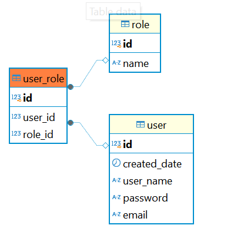
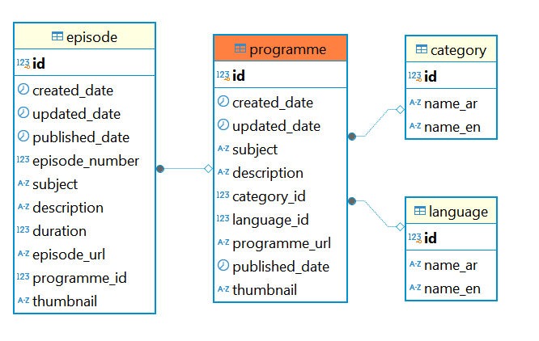
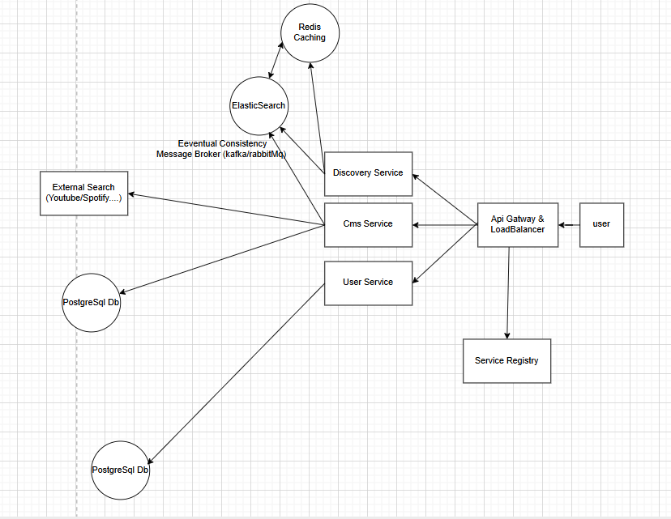

تقرير يحتوي على كيفية عمل نظام إدارة المحتوى (cms) و نظام البحث و الاكتشاف (Discovery) و طرق تحسين النظام

الأدوات المستخدمة :
-  لغة البرمجة + إطار العمل : جافا (Java17) + سبرنج بوت (Springboot)
- قاعدة البيانات : PostgreSql
- أداة إدارة التغييرات على قاعدة البيانات : (Liquibase For Migration Scripts)

ملحوظة :- رغم معرفتي المبدئية بلغة Go ضمن برنامج تطويري الذاتي، فضلت استخدام Java لضمان تسليم حل جيد ومدعوم بخبرة عملية ، مع الاستعداد التام للعمل بأي لغة أو إطار مطلوب في المستقبل.

طريقة الحل و بناء التطبيق :

- يتكون التطبيق من جزئين أساسيين : نظام ادارة المحتوى (cms) و نظام البحث و الاكتشاف (discovery) و تم بناء كل نظام كوحدة مصغرة مستقلة (Microservice) للسماح مستقبلا بأن تكون قابلة للتوسع و القدرة على تحمل ملايين المستخدمين و إضافة خصائص أخري جديدة  وبذلك يجعل كل وحدة مصغرة (microservice) تقوم بوظائفها و مسؤولياتها الخاصة طبقا للمبدأ الأول من مبادئ ال (solid principles) و هو (Single Responsibility Principle - SRP)

- تتكون كل وحدة مصغرة (microservice) من عدة حزم (packages) و يمكن اعتبار كل حزمة في أي وحدة مصغرة  حاليا بأنها (module) بحيث كل موديول يعمل بمعزل عن الأخر ويملك مسؤولياته و وظائفه الخاصة فقط (Single Responsibility Principle - SRP).

- تم تقليل الترابط (Low coupling) بين الموديولات (modules) في كل وحدة مصغرة (microservice) بحيث أن كل موديول (module) يعمل باستقلالية قدر الإمكان ولا يعتمد بشكل مباشر على تفاصيل الأجزاء الأخرى و كل موديول (module) مستقل في هيكلته بحيث يعتمد فقط على الخدمات عبر الواجهات (interfaces) وليس على تفاصيل التنفيذ وتم فصل البيانات عن المنطق بحيث تم تعريف ال (dto, entity, service,serviceImpl,repository mapper ) في الموديولات بحيث يجعل ال (module) مسؤولاً عن نفسه وهناك في كل وحدة مصغرة (microservice) موديول مشترك (shared) بحيث يتم بداخله إضافة عناصر عامة يمكن استخدامها في الموديولات الاخرى بحيث يقلل الحاجة لتكرار أو اعتماد متبادل بين الموديولات (modules).

- تم تطبيق مبدأ (Dependency Inversion Principle) من مبادئ SOLID، حيث أن الطبقات العليا مثل الـ Controller لا تعتمد على الطبقات السفلى مثل ServiceImpl مباشرة، بل تعتمد على واجهات مجردة (Service Interfaces) وهذا النمط مطبّق بشكل موحد داخل الموديولات(modules) في كل (microservice) مما يعزز القابلية للاختبار، والتوسعة، والاستبدال دون تأثير جانبي على باقي الأجزاء.

-
- تم توثيق جميع نقاط الوصول (Endpoints) في كل وحدة مصغرة (microservice) باستخدام  Swagger، مما يسهل على مطوري الواجهة الأمامية فهم واستخدام الـ APIs بشكل مباشر وموثوق

1 - نظام إدارة المحتوى (cms microservice) :
يتكون نظام إدارة المحتوي من خمس  موديولات (البرنامج و الحلقات و موديول نظام البحث الخارجي لاستيراد معلومات من مصادر خارجية  و موديول النظام الأمني  و موديول مشترك بين جميع الموديولات)

موديولات نظام إدارة المحتوى :

1 - موديول البرنامج (Programme Module) :
يحتوي على البيانات الوصفية (metadata) الخاصة بالبرنامج (programme) مثل
تاريخ الاضافة (createdDate)  و تاريخ التحديث (updatedDate)  و العنوان (subject) و الوصف (description) و التصنيف (category) و اللغة (language) و رابط البرنامج (programmeUrl)  وتاريخ النشر (publishedDate) و صورة مصغرة للبرنامج (thumbnail)

يحتوي على واجهات برمجية (RestApis) مدعومة بالتحقق من صحة البيانات مثل إضافة برنامج جديد (addNewProgramme) و تعديل برنامج معين (updateProgramme) و تم اضافة صلاحيات (Authentication&Authorization) علي الواجهات البرمجية السابقة بحيث يمكن فقط لمدير المحتوى (Content Manager) أو المحررين (Content Editor) باستخدامهم

2- موديول الحلقات (Episode) :
يحتوي على البيانات الوصفية (metadata) الخاصة بالحلقة (episode) مثل
تاريخ الاضافة (createdDate) و تاريخ التحديث (updatedDate) و العنوان (subject) و الوصف (description) و رابط الحلقة (episodeUrl)  تاريخ النشر (publishedDate) و صورة مصغرة للحلقة (thumbnail) و مدة الحلقة (duration)  والبرنامج الخاص بالحلقة (programme)

تم ربط الحلقات بالبرنامج (programme) بعلاقة (ManyToOne) حيث ان البرنامج من الممكن أن يحتوي على عدة حلقات.يمكن تخيلها بمثال من الواقع في موقع اليوتيوب أن قائمة التشغيل (playlist) تحتوي على عدة حلقات (episodes) حيث قمت بالاستعانة بقناة ثمانية علي اليوتيوب

يحتوي على واجهات برمجية (RestApis) مدعومة بالتحقق من صحة البيانات مثل اضافة حلقة جديدة علي برنامج معين (addNewEpisode) وتعديل الحلقة (updateEpisode) و تم اضافة مصادقة و تفويض (Authentication&Authorization) علي الواجهات البرمجية السابقة بحيث يمكن فقط لمديرين المحتوى (Content Manager) أو المحررين (Content Editor) باستخدامهم

3-  موديول البحث الخارجي لاستيراد معلومات من مصادر خارجية (External Search):

يحتوي على واجهة برمجية (Generic RestApi) و هي (import) بحيث تسمح استيراد المعلومات من أي مصدر خارجي (.............Youtube,Spotify,Dailymotion,etc) مدعومة بصلاحيات (Authentication & Authorization) بحيث تسمح فقط لمدير المحتوى (CONTENT_MANAGER) أو محرر المحتوى (CONTENT_EDITOR) باستخدامها

تقوم الواجهة البرمجية داخل الوحدة بالبحث الخارجي عن طريق ارسال (Request Params) و هم كلمة البحث (querySearch) و نوع المصدر الخارجي (sourceType) و من داخل الكود يتم التواصل (integration) مع (third party apis) مزودة من المصدر الخارجي ومن ثم يتم اصدار المعلومات ولقد قمت بتنفيذ مثال على ذلك باستيراد المعلومات من اليوتيوب حيث يمكن إرسال حاليا داخل الواجهة البرمجية على سبيل المثال (querySearch:قناة ثمانية و sourceType:YOUTUBE) وسوف يتم استعادة البيانات على شكل برامج (programmes) و كل برنامج لديه الحلقات الخاصة بيه (episodes)

لقد قمت باستخدام أحد مبادئ التصميم (design patterns) و هو نمط المصنع (factory method pattern) وظيفته هي اختيار المصدر المناسب (مثل YouTube) بناءً على نوع المصدر (SourceType) المرسل من المستخدم و يمكن بعد ذلك اضافة اي نوع مصدر آخر في الكلاس  (ExternalDataSourceFactory)

لقد قمت ايضا باستخدام أحد مبادئ التصميم (design patterns) و هو نظام الاستراتيجية (Strategy Design Pattern)  وظيفته هي أن كل نوع مصدر بيانات (YouTube Spotify، إلخ) يُنفذ منطقًا خاصًا مثل (.....YoutubeDataSource,SpotifyDataSource,etc) به لجلب البيانات، لكنهم جميعًا يتبعون نفس الواجهة (ExternalDataSource) و يُسمح بتبديل المصادر بسهولة دون التأثير على باقي الكود، لأن كل مصدر يتبع نفس الواجهة (interface).

4- موديول النظام الأمني (security) :

يحتوي على البيانات الوصفية (metadata) الخاصة بالمستخدم (user) مثل تاريخ الاضافة (createdDate) و اسم المستخدم (userName) و الايميل (email) و كلمة السر (password)  و الأدوار الممنوحة له (roles)

يحتوي على واجهات برمجية (RestApis) مدعومة بالتحقق من صحة البيانات (metadata) مثل اضافة مستخدم جديد (signUp) من داخل المنظمة ومنح أدوار (roles) له  و تم اضافة الي قاعدة البيانات عدد اتنين أدوار هم مدير المحتوى (CONTENT_MANAGER) و محرر المحتوى (CONTENT_EDITOR) ويتم اضافة هذه الادوارمن داخل الكود عند اضافة مستخدم جديد من داخل المنظمة (يمكن تحسين هذه النقطة مستقبليا و سأذكرها في نقاط تحسين النظام)

يحتوي على واجهات برمجية(RestApi) اخري مثل تسجيل الدخول للمستخدم من داخل المنظمة و التحقق من البيانات الخاصة بيه مثل اسم المستخدم (userName) و كلمة السر (password) و الأدوار الممنوحة له (roles) و عند التأكد من صحة البيانات يتم الاستجابة ب (jwt token) تثبت تسجيل الدخول بنجاح و يمكن بعد ذلك  للمستخدم استخدام ال (token) للإضافة و تعديل البرامج أو إضافة و تعديل حلقات البرنامج او استيراد معلومات من مصادر خارجية

قمت بتخزين كلمة السر بشكل آمن من خلال تشفيرها (Hashed) باستخدام BCrypt قبل حفظها في قاعدة البيانات، وذلك لحماية بيانات المستخدمين ومنع الوصول غير المصرح به في حال تم اختراق قاعدة البيانات.

5- الموديول المشترك (shared) :

يحتوي على عناصر تستخدم في معظم أنحاء الوحدة المصغرة (microservice) بطريقة موحدة ومشتركة بين الوحدات (مثل البرامج أو الحلقات أو البحث الخارجي و النظام الأمني) مثل (dto/ApiResponse) لتوحيد الاستجابات (responses) القادمة من الواجهات البرمجية بشكل موحد (data,timeStamp,statusCode,totalCount,totalPages)

ايضا تحتوي علي حزمة (exception) للتعامل مع الأخطاء القادمة من الواجهات البرمجية في الوحدات الأخرى و معالجتها  (handling errors&exceptions)

يحتوي على حزمة إعدادات (OpenApiConfig) يُستخدم هذا الكلاس لتهيئة Swagger/OpenAPI لعرض الـ API بشكل مرئي و يضيف دعم JWT Token حتى يمكن تجربة الـ API المحمية داخل واجهة Swagger.

6- حزمة الاختبار (unitTesting):
تحتوي علي عدد اثنين حزمة (Two Packages) و هم (episodeUnitTesting) و (programmeUnitTesting) و كل حزمة تحتوي على اختبارات ال (unitTesting) الوظائف الخاصة بالبرامج و الحلقات

شكل مبسط لبناء قاعدة البيانات للوحدة المصغرة (cmc-microservice):

2 - نظام البحث و الاكتشاف (discovery microservice) :
يقوم نظام البحث و الاكتشاف بالتواصل (synchronous communication) مع نظام إدارة المحتوى (cms microservice) للحصول والبحث عن معلومات مثل البرامج و الحلقات بحيث يتم عرضها لعموم المستخدمين للتطبيق و يوجد طريقة جيدة لتحسين التواصل سأذكرها لاحقا في طرق التحسين

موديولات نظام البحث و الاكتشاف :

1 - موديول البرنامج (Programme Module) :
يحتوي على واجهات برمجية عمومية (Public RestApis) مثل (getListOfProgrammes)
وتتواصل مع نظام إدارة المحتوى (cms-microservice) بطريقة (synchronously) للحصول والبحث عن البرامج والحلقات الخاصة بكل برنامج. تقوم هذه الواجهة البرمجية باستعادة البيانات على هيئة صفحات (pages). لقد قمت ايضا بإضافة فلتر (filter) بحيث يمكن للمستخدم الذهاب إلي صفحة معينة (page Number) و ايضا عرض البيانات الخاصة بالصفحة و التحكم في عدد العناصر(pageSize) التي يمكن استرجاعها في كل صفحة و تم اضافة ايضا الى الفلتر حقول يمكن للمستخدم الاستعانة بها للبحث بواسطتها مثل (عنوان البرنامج , وصف البرنامج , تاريخ نشر البرنامج , تصنيف البرنامج , لغة البرنامج , عنوان الحلقة , وصف الحلقة , رقم الحلقة , تاريخ نشر الحلقة و مدة الحلقة)
(programmeSubject,programmeDescription,programmePublishedDate,
categoryNameAr,LanguageNameAr,episodeSubject,episodeDescription
,episodeNumber,episodePublishedDate,episodeDuration)

يحتوي على واجهات برمجية أخرى عمومية (Public RestApis) و تتواصل مع نظام إدارة المحتوى (cms-microservice) بطريقة (synchronously)  مثل (getProgrammeById) حيث يمكن لعموم المستخدمين بالاستعانة بها لعرض تفاصيل برنامج معين و تفاصيل الحلقات الخاصة بيه.
(تاريخ الاضافة , تاريخ التحديث, عنوان البرنامج , وصف البرنامج , التصنيف , اللغة , رابط البرنامج , تاريخ النشر , صورة مصغرة من البرنامج )

2 - موديول الحلقة (Episode Module) :
يحتوي على واجهات برمجية عمومية (Public RestApis) مثل (getEpisodeById) وتتواصل مع نظام إدارة المحتوى (cms-microservice) بطريقة (synchronously)
حيث يمكن لعموم المستخدمين بالاستعانة بها لعرض تفاصيل الحلقة (تاريخ الاضافة , تاريخ التحديث , تاريخ النشر , رقم الحلقة , عنوان الحلقة , وصف الحلقة , مدة الحلقة , رابط الحلقة , صورة مصغرة من الحلقة)

3 - أهم الصعوبات التي قمت بمواجهتها :

في البداية ترددت بين استخدام نظام أحادي (Monolithic) أو وحدات مصغرة (Microservices)، لكنني اخترت Microservices لضمان القابلية للتوسع مستقبلاً، وسهولة إضافة خصائص جديدة

قمت ببناء الكائنات (entities)  عن طريق الاستعانة بمصادر خارجية مثل قناة ثمانية على يوتيوب كمثال واقعي، واستقريت على بناء البرنامج (programme) و الحلقة (episode) وعلاقة تربط بينهم (ManyToOne) حيث ان عدة حلقات يمكن ان تكون خاصة ببرنامج معين

احتجت لتقييد عمليات الإضافة والتعديل على البرامج والحلقات والاستيراد من مصادر خارجية، لذلك استخدمت JWT مع Spring Security لتوفير مصادقة وتفويض (Authrntication & Authorization) على حسب الدور مثل ( Content Manager وEditor).

ركزت على تصميم الموديولات بحيث تكون منفصلة في المهام (Single Responsibility) وتعتمد على الواجهات وليس على التنفيذ، مما ساهم في تعزيز الاختبار والصيانة.

واجهت تحديًا في بناء طريقة مرنة لاستيراد البرامج من مصادر مثل YouTube، واعتمدت على نمط المصنع (Factory Pattern) لاختيار المصدر المناسب، ونمط الاستراتيجية (Strategy Pattern) لتنفيذ منطق كل مصدر بشكل منفصل قابل للتبديل.

قمت بحل مشكلة N+1 Query أثناء إضافة الحلقات عبر جلب جميع البرامج المرتبطة من قاعدة البيانات باستخدام findAllById وتخزينها في Map، مما وفر تنفيذ استعلام منفصل لكل حلقة وقلل عدد الاتصالات بقاعدة البيانات بشكل كبير.ايضا قمت بحل المشكلة عند جلب البرامج وحلقاتها، عن طريق تحميل كل الحلقات دفعة واحدة باستخدام findByProgrammeIds، ثم ربطها بالبرامج باستخدام Map، بدلًا من تنفيذ استعلام منفصل لكل برنامج من قاعدة البيانات

4- الحلول المقترحة لتحسين النظام الحالي :

1- اضافة تتبع موزع (Distributed Tracing For Observability) للمراقبة و تتبع حركة الطلبات عبر نظام إدارة المحتوى و نظام البحث و الاكتشاف في النظام (Tracing across microservices) وكشف الأعطال ومناطق البطئ بدقة.

2- بدلا من وضع جداول المستخدمين وصلاحياتهم (users&roles) في نظام إدارة المحتوى الحالي (cms microservice) يمكن اضافة وحدة مصغرة اخرى اسمها (user service) تشمل قاعدة بيانات المستخدمين وصلاحياتهم و الواجهات البرمجية الخاصة باضافة المستخدمين ومنح الصلاحيات (Content_Manager,Content_Editor)لهم وتنفيذ كامل لنظام الأمان (security) للتطبيق بحيث تكون قابلة للتوسع مستقبلا و مشاركة بيانات المستخدمين عبر أكثر من نظام مستقبلا (مثل CMS وDiscovery )

3- إضافة (Api Gateway) : يسهل إدارة جميع الطلبات من المستخدمين، ويوفر طبقة أمن(Authentication & Authorization) وتوجيه للطلبات الي الوحدات المصغرة الخاصة بها (microservices)

4- إضافة (Load Balancer) لتحسين اتاحية النظام (system availability) و موازنة الأحمال على النظام بحيث يحسن الأداء وسرعة الاستجابة

5- بدلا من التواصل الحالي (synchronous communication) بين نظام البحث و الاكتشاف (discovery service) و نظام ادارة المحتوى (cms service) يمكن فصل النظامين  اضافة (message broker kafka/rabbitMq) حيث يقوم نظام إدارة المحتوى عند اي اضافة او تعديل برنامج أو حلقة إرسال رسالة عبر(message broker kafka/rabbitMq) تحمل البيانات المضافة أو المحدثة الى (elastic search) ومن ثم يمكن لنظام البحث و الاكتشاف بالاستعانة ب (elastic search) بدلا من التواصل (synchronously) مع نظام إدارة المحتوى (cms microservice) للحصول على البيانات وتنفيذ عمليات بحث معقدة و الفلترة عبر إمكانيات متقدمة مثل (full text search)مما يعطي  سرعة عالية في الاستعلامات لملايين المستخدمين مقارنة بقاعدة بيانات (postgreSql) و بذلك ستكون ٌاعدة البيانات الخاصة بنظام ادارة المحتوى فقط للاضافة و التحديث و ارسال رسائل بالداتا المضاف أو المحدثة الى (elastic search) مما يحسن اداء النظام بشكل كبير و استيعاب ملايين المستخدمين

6- يمكن إضافة (redis caching) مع نظام البحث و الاكتشاف لتقليل الضغط على ال (elastic search) للبيانات التي يتم استرجاعها بشكل متكرر و تخزينها ذاكرة عالية السرعة (redis) وبذلك زمن الاستجابة للمستخدمين عند تكرار نفس عمليات البحث

7- يمكن اضافة circuit breaker إذا كانت خدمات التطبيق (cms+discovery+user microservices) و ايضا (elastic search + redis) لا تستجب للطلبات بحيث يمنع تكرار المحاولات الفاشلة التي تضغط على النظام و اعطاء فرصة للخدمة بالتعافي بعد اصلاحها

8- يمكن إضافة (Service Discovery/Registry) بحيث تقوم الخدمات (cms+user+discovery microservices) بتسجيل مواقعها (ip addresses) و بعد ذلك تقوم ال (Api Gateway) باكتشاف مواقع الخدمات من خلاله، ثم يوزّع الطلبات باستخدام Load Balancer

9- يمكن إضافة (Api Key) علي الواجهات البرمجية العمومية (Public RestApis) في نظام البحث و الاكتشاف لتجنب سوء استخدام الواجهات البرمجية العمومية

10- يمكن إضافة ملف(docker-compose.yml) لتسهيل التشغيل على البيئات المختلفة (Multible Environemts)

يمكن الاطلاع على الشكل المعماري الجديد للتطبيق في الصفحة القادمة

الشكل الحالي يوضح الرسم المعماري الجديد المقترح و اضافة التحسينات

  

